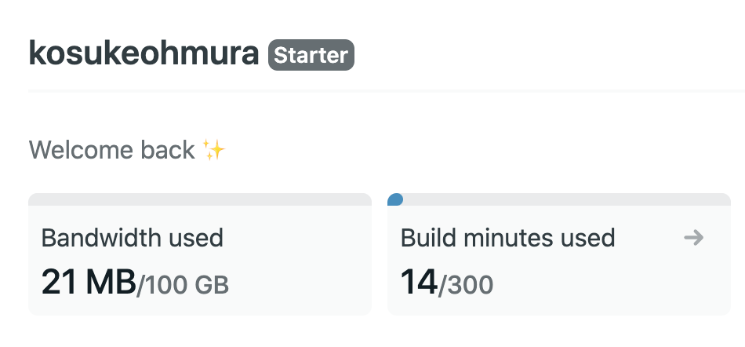

このブログは Netlify の無料プランでビルドとホスティングをしており、月 300 分のビルド時間上限と、100 GB の転送量上限がある。転送量上限は置いておいて、ビルド時間上限は記事が増えてくると到達するかもしれない。

上限に到達したら 7 USD 払えばいいとも思ったが、ブログを書く心理的障壁をできるだけ取り除いておきたいと言う気持ちになり、Netlify で行っていたビルドを GitHub Actions で行うことにした。

- [Netlify Pricing and Plans](https://www.netlify.com/pricing/)

## GitHub Actions のいいところ

public リポジトリだと無料なのでビルド時間を気にしなくてよい。あとはもちろん GitHub との連携が楽なのと、あるあるな処理には Action が存在し、シェルスクリプトをあまり書かなくて済むのが良い。

- [About billing for GitHub Actions - GitHub Docs](https://docs.github.com/en/github/setting-up-and-managing-billing-and-payments-on-github/about-billing-for-github-actions#about-billing-for-github-actions)

## 作業

まず Netlify 上のサイトの設定でビルドが走るのを止める。

次に GitHub Actions の設定ファイルを書く。あまり変わった点はないが、[GitHub の example](https://github.com/actions/cache/blob/main/examples.md#node---npm) どおりにパッケージをキャッシュした。`npm ci` でパッケージをインストールし、`.npm` をキャッシュするのが最近の正しいやり方らしい。

ソースコードはこちら。

- [Deploy by GitHub Actions · KosukeOhmura/kosukeohmura.com@f90df27](https://github.com/KosukeOhmura/kosukeohmura.com/commit/f90df2785d36edd97ddba904604ca0759b672100)
